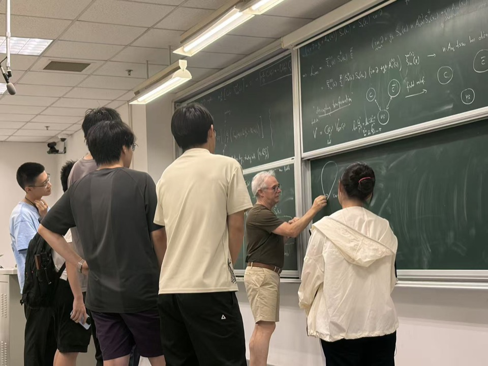
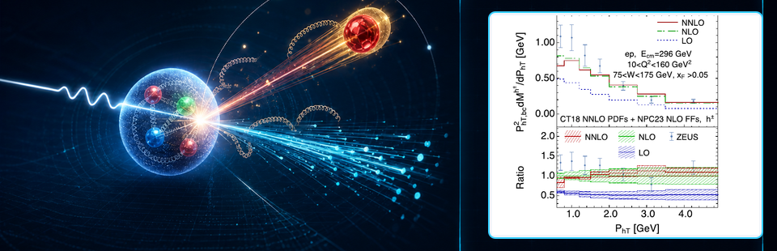
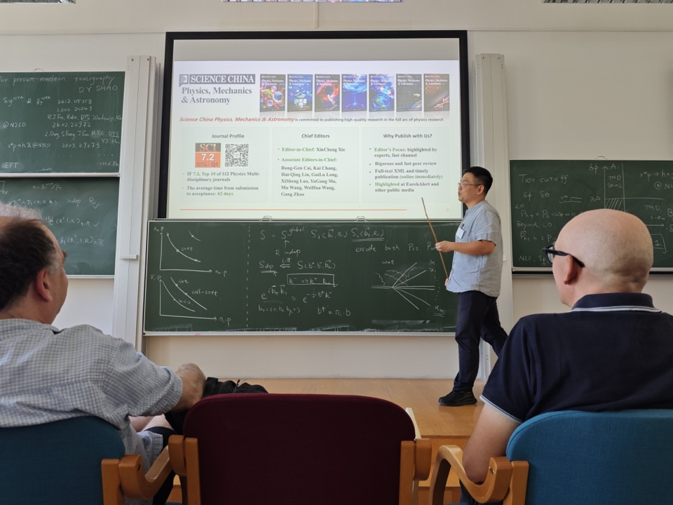
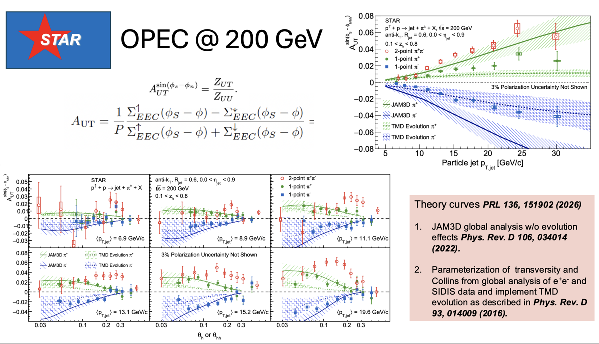
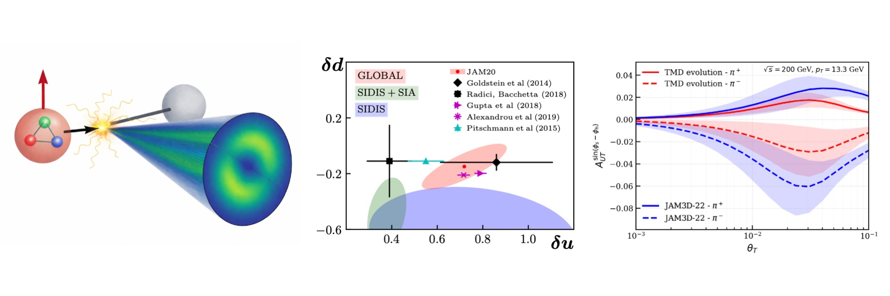
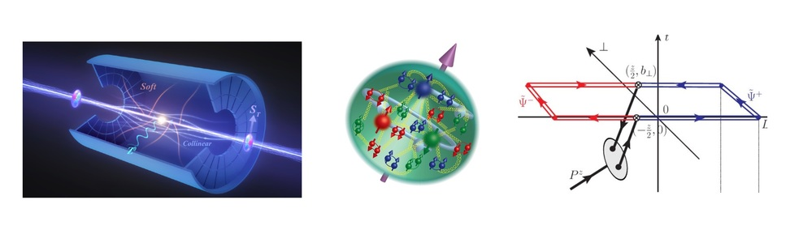
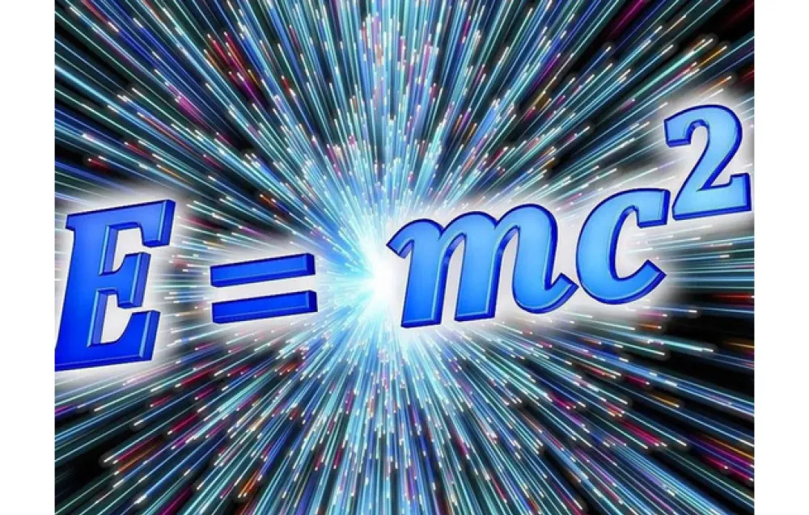
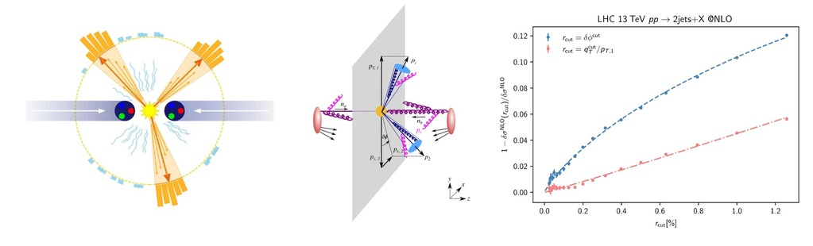

# News

## 2026

- **复旦粒子物理暑期学校2026顺利闭幕**
   2026年8月29日
   
    
    Matthias Neubert教授课后与同学们交流
  
   为期两周的“复旦粒子物理暑期学校2026”顺利闭幕。本届暑期学校由复旦大学物理学系主办，吸引160多名海内外学员报名参加。十位国际知名专家围绕机器学习、广义对称性、能量关联函数、暗物质、软共线有效理论、散射振幅及对撞机物理等主题开展系统授课，师生围绕粒子物理前沿问题进行了深入交流。
   [查看详情](https://phys.fudan.edu.cn/0b/47/c7451a789319/page.htm)
   
   

- **祝贺邵鼎煜老师、李婉辰博士获批2026年度国家自然科学基金项目**
   2026年8月26日
   近日，2026年国家自然科学基金集中接收申请项目评审结果公布。课题组邵鼎煜老师申报的国家自然科学基金面上项目、李婉辰博士申报的国家自然科学基金青年科学基金项目（C类）获批资助。向两位项目负责人表示热烈祝贺！
   [基金委通知](https://www.nsfc.gov.cn/p1/3381/2822/141011.html)
   
   

- **邵鼎煜课题组与合作者实现深度非弹性散射有限横动量强子产生的精确预言**
   2026年8月23日
   
   复旦大学物理学系邵鼎煜课题组与合作者首次实现了深度非弹性散射中有限横动量强子产生的完整次次领头阶（NNLO）量子色动力学修正。该研究将基于“赢家通吃”（Winner-Take-All，WTA）喷注定义的横动量减除方法应用于含强子的深度非弹性散射，显著改善了微扰展开的收敛性并降低了理论不确定性，为未来电子—离子对撞机中部分子分布函数和碎裂函数的精确提取建立了新的理论基准。相关成果以“Next-to-Next-to-Leading-Order QCD Corrections to Hadron Production in Deep-Inelastic Scattering at Finite Transverse Momentum”为题，发表在《Physical Review Letters》（Phys. Rev. Lett. 137, 081902 (2026)）。
   [查看详情](https://phys.fudan.edu.cn/07/b9/c7609a788409/page.htm)
   
   

- **邵鼎煜老师受邀参加ESI学术会议并作学术报告**
   2026年8月11日
   
    
    邵鼎煜老师向与会国际专家介绍《Science China Physics, Mechanics &amp; Astronomy》期刊
  
   邵鼎煜老师受邀参加维也纳大学Erwin Schrödinger International Institute for Mathematics and Physics（ESI）举办的学术会议“New Paradigms for Harnessing Quantum Field Theory at Colliders”，并作学术报告。
   [会议主页](https://www.esi.ac.at/events/e588/)
   
   

- **课题组师生参加中国物理学会高能物理分会第十二届全国会员代表大会暨学术年会**
   2026年7月13日至19日
   中国物理学会高能物理分会第十二届全国会员代表大会暨学术年会在广州召开。我课题组邵鼎煜老师受邀作邀请报告，李婉辰博士和符荣峻同学分别作口头报告，方申同学进行海报展示。方申同学的海报荣获本次会议优秀墙报奖，为课题组争得了荣誉。
    此次会议期间，课题组围绕高能物理前沿问题与同行进行了深入交流，展示了近期取得的系列研究成果，得到与会专家的关注与讨论。
    会议相关报告链接：
   &bull; 邵鼎煜邀请报告：[indico](https://indico.ihep.ac.cn/event/28557/contributions/223364/)
   &bull; 李婉辰博士报告：[indico](https://indico.ihep.ac.cn/event/28557/contributions/222563/)
   &bull; 符荣峻同学报告：[indico](https://indico.ihep.ac.cn/event/28557/contributions/222542/)
   &bull; 方申同学海报：[indico](https://indico.ihep.ac.cn/event/28557/contributions/222566/)
   
   

- **课题组本科生毕业季荣获多项荣誉**
   2026年6月
   毕业季来临，课题组两位本科生同学荣获多项荣誉。施昊哲同学获评复旦大学"毕业生之星"荣誉称号，未来将在龚新高院士指导下，在AI与物理领域继续深造。林士佳同学荣获首届希德学士奖，将赴加州大学伯克利分校（UC Berkeley）攻读博士学位。
    在课题组期间，两位同学在AI、量子信息与高能物理交叉领域参与完成多项学术工作：
   &bull; 施昊哲同学参与完成论文 "Nested-GPT for variable-multiplicity parton showers: A case study in the resummation of non-global logarithms"（[arXiv: 2605.18360](https://arxiv.org/abs/2605.18360)）。
   &bull; 林士佳同学参与完成论文 "Decoherence in high energy collisions as renormalization group flow"（[arXiv: 2510.13951](https://arxiv.org/abs/2510.13951)）、"Spin correlations and Bell nonlocality in ΛΛ̄ pair production from e⁺e⁻ collisions with a thrust cut"（[JHEP 11 (2025) 082](https://arxiv.org/abs/2507.15387)）。
   
   

- **课题组成员在QCD Evolution 2026国际会议作学术报告**
   2026年5月11日至15日
   QCD Evolution 2026国际会议在西班牙马德里埃斯科里亚尔（El Escorial）举行。会议聚焦强子三维成像、电子—离子对撞机物理、横动量依赖分布、小x物理以及量子色动力学中的微扰和非微扰技术等前沿方向。课题组李婉辰博士、符荣峻同学和方申同学参会并分别作学术报告，与国际同行交流最新研究成果。
    会议相关报告：
   &bull; 李婉辰博士报告：[[indico]](https://indico.fis.ucm.es/event/37/contributions/849/)
   &bull; 符荣峻同学报告：[[indico]](https://indico.fis.ucm.es/event/37/contributions/840/)
   &bull; 方申同学报告：[[indico]](https://indico.fis.ucm.es/event/37/contributions/837/)
   [会议主页](https://indico.fis.ucm.es/event/37/)
   
   

- **李婉辰博士在DIS2026国际会议作报告，课题组PRL成果获大会重点介绍**
   2026年5月4日至8日
   第三十三届深度非弹性散射及相关主题国际研讨会（33rd International Workshop on Deep Inelastic Scattering and Related Subjects，DIS2026）在意大利博洛尼亚举行。课题组李婉辰博士参会并作学术报告。
    **值得关注的是，课题组发表于《Physical Review Letters》的理论文章（PRL 136, 151902 (2026)）被大会报告《The 25 years RHIC legacy of QCD》重点介绍，并作为与STAR实验结果对比的理论曲线展示。**
   
    
    大会报告中展示课题组发表于《Physical Review Letters》的理论曲线
  
   李婉辰博士报告：[[indico]](https://agenda.infn.it/event/47074/contributions/289127/)
   大会报告：[[indico]](https://agenda.infn.it/event/47074/contributions/289175/)
   [会议主页](https://agenda.infn.it/event/47074/)
   
   

- **邵鼎煜老师受聘为南方核科学理论研究中心访问科学家**
   2026年5月
   邵鼎煜老师受聘为中国科学院近代物理研究所南方核科学理论研究中心（Southern Center for Nuclear-Science Theory，SCNT）“访问科学家”。
   
   

- **邵鼎煜课题组与合作者提出利用喷注单点能量关联研究质子横向性分布及张量荷**
   2026年4月17日
   
   复旦大学物理学系邵鼎煜课题组与合作者在量子色动力学与质子结构研究领域取得重要进展，提出一种基于喷注能量分布的新方法，用于探测质子内部自旋结构中最难测量的分量之一——横向性分布与张量荷。相关成果以"Accessing Nucleon Transversity with One-Point Energy Correlators"为标题，发表在《Physical Review Letters》(PRL 136, 151902 (2026))。
   [查看详情](https://phys.fudan.edu.cn/da/65/c7609a776805/page.htm)
   
   

- **课题组成员在SCET 2026国际会议作学术报告**
   2026年3月2日至5日
   第二十三届软共线有效场论年度研讨会（The XXIII Annual Workshop on Soft-Collinear Effective Theory，SCET 2026）在韩国首尔高等科学院（KIAS）举行。课题组李婉辰博士、符荣峻同学和方申同学受邀参会并分别作学术报告，与国际同行交流课题组在能量关联函数、无反冲喷注轴和核子三维成像等方向的最新研究成果。
    会议相关报告：
   &bull; 李婉辰博士报告：[[indico]](https://indico.nuclear.korea.ac.kr/event/87/contributions/378/)
   &bull; 符荣峻同学报告：[[indico]](https://indico.nuclear.korea.ac.kr/event/87/contributions/374/)
   &bull; 方申同学报告：[[indico]](https://indico.nuclear.korea.ac.kr/event/87/contributions/375/)
   [会议主页](https://indico.nuclear.korea.ac.kr/event/87/)
   
   

- **邵鼎煜课题组与合作者提出利用零喷注度实现质子三维结构重建**
   2026年1月15日
   
   邵鼎煜课题组与合作者提出利用"零喷注度"（zero-jettiness）作为"噪声抑制器"，有效抑制初态辐射背景，实现质子三维结构重建，并检验西弗斯函数（Sivers function）的符号翻转。相关成果发表在《Physical Review Letters》（2026年1月14日）。
   [查看详情](https://phys.fudan.edu.cn/eng/b5/21/c11995a767265/page.htm)
   
   

- **媒体报道：科学家指出在金-金碰撞中寻找光子变物质的可行性**
   2026年1月20日
   
    
  
   腾讯新闻报道复旦大学邵鼎煜、杭州师范大学张成团队在《中国科学》上发表的关于RHIC超偏心重离子碰撞中光子诱导质子-反质子对产生的研究，科普了在高能重离子碰撞中通过光子-光子融合产生物质的过程及其科学意义。
   [查看详情](https://news.qq.com/rain/a/20260120Q05O4000)
   
   

## 2025

- **邵鼎煜课题组与合作者提出量子色动力学红外发散减除的新理论**
   2025年10月22日
   
   邵鼎煜课题组与合作者提出基于"赢家通吃"（Winner-Take-All, WTA）方案的横动量减除方法，首次使横动量减除方法适用于多喷注过程，为LHC多喷注末态的高阶精确计算提供了全新理论基础。相关成果发表在《Physical Review Letters》（2025年10月21日）。
   [查看详情](https://phys.fudan.edu.cn/7b/31/c7609a752433/page.htm)
   
   
